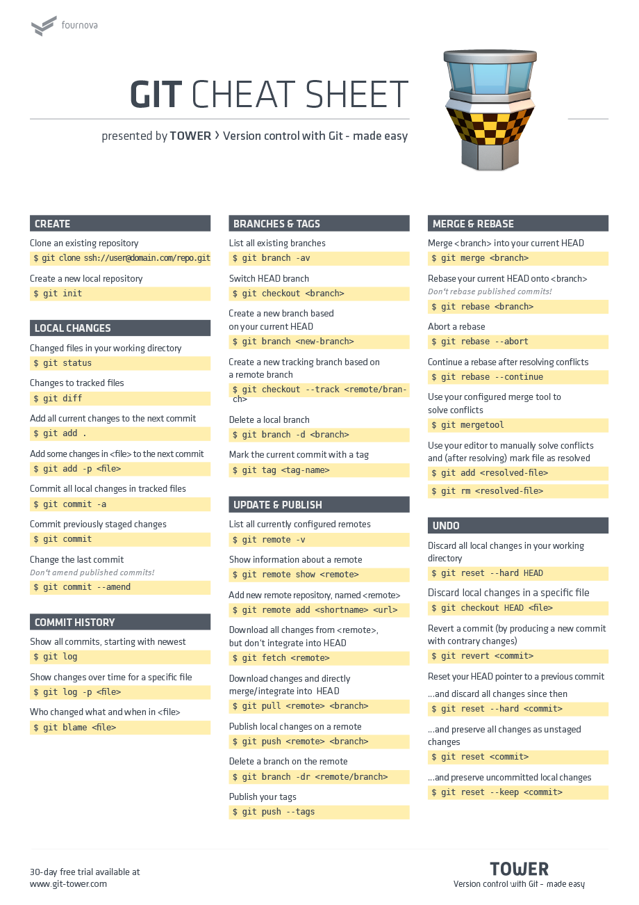

Git Basic Commands & Workflow
=============================
-----------------------------
[Source](https://git-scm.com/book/en/v2)

### 0. Configure
```bash
git config --list --show-origin

# add global configurations
git config --global user.name "John Doe"
git config --global user.email johndoe@example.com

# or use --local to only configure git for the local project
git config --local user.name "John Doe"
git config --local user.email johndoe@example.com

# configure specific merge tools
git config --local merge.tool meld
git config --local  diff.guitool meld

# example for windows users
git config --local mergetool.meld.path /c/Program files (x86)/meld/bin/meld

#
# for .bashrc on Linux and .bash_profile on Unix/ MacOS
#

# custom gitclean command to clean up all local branches
git_clean() {
    git branch | grep -v "master" | xargs git branch -D
}

# custom push command to push new branch upstream
push_new_branch() {
    git push -u origin $(git branch --show-current)
}
```

### 1. Basic git commands:

Use Git commands to help keep track of changes made to a project:
- **git init** creates a new Git repository.
- **git status** inspects the contents of the working directory and staging area.
- **git add filename** adds specified file from the working directory to the staging area.
- **git add .** adds all files that are indexed or tracked to the staging area.
- **git restore filename** rolls back changes to specified file.
- **git restore .** rolls back all local changes.
- **git restore --staged .** restores staged files and unstages them.
- **git diff** shows the difference between the working directory and the staging area.
- **git commit** permanently stores file changes from the staging area in the local repository.
- **git commit --amend -m "commit message"** updates last commit message.
- **git commit --amend --no-edit** updates last commit with additional staged changes.
- **git log** shows a list of all previous commits; commit logs.
- **git log --oneline** shows a list of all previous commits condensed to one line.
- **git clean -f** removes all untracked files.

------------
### 2. Backtracking

In Git, the commit you are currently on is known as the HEAD commit. In many cases, the most recently made commit is the HEAD commit.

To see the HEAD commit, enter:
- **git show HEAD**

If you want to discard the changes to a file in the working directory, enter:

- **git checkout HEAD filename**
- **git restore filename**

To unstage files you already staged with **git add**, enter:

- **git reset HEAD filename**

If you want to go back to a previous commit in your commit history, enter:

- **git reset commit_SHA**

Note that you only need the first 7 characters. For example, if the SHA of the previous commit is da39a3ee5e6b4b0d3255bfef95601890afd80709 you can simply type `git reset da39a3e`

------------
### 3. Branching

The following commands are useful in the Git branch workflow.
- **git branch** Lists all local branches.
- **git branch --all** Lists all a Git project’s branches.
- **git branch branch_name** Creates a new branch.
- **git branch branch_name ref_branch** Creates a new branch from a reference branch.
- **git checkout branch_name** Used to switch from one branch to another.
- **git checkout -b branch_name** creates a new branch and switches to it.
- **git checkout -b branch_name ref_branch** creates a new branch from a reference branch and switches to it.
- **git merge branch_name** Used to join file changes from specified branch to the branch you are currently on.
- **git branch -d branch_name** Deletes the branch specified.
- **git branch -D branch_name** Forcefully deletes the branch specified.

------------
### 4. Collaboration

First of all you get the source code of a specific project/ remote repository:

- **git clone remote_location clone_name**

You can see a list of a Git project’s remotes with the command:

- **git remote -v**

An easy way to see if changes have been made to the remote and bring the changes down to your local copy is with:

- **git fetch**

This command will not merge changes from the remote into your local repository. It brings those changes onto what’s called a remote branch.
Even though new commits have been `fetched` to your local copy of the Git project, those commits are on the `origin/master branch`. Your local master branch has not been updated yet, so you can’t view or make changes to any of the work that was added. Therefore enter:

- **git merge origin/master**

**Alternatively:**
You could also go into your local master branch and enter:

- **git pull** 

It is essentially just a shorthand for `git fetch; git merge origin/master` and it will bring your local master up to date.

#### The workflow for Git collaborations typically follows this order:

1. Fetch and merge changes from the remote `git fetch; git merge origin/master` or `git checkout master; git pull`
2. Create a branch to work on a new project feature `git checkout -b branch_name master`
3. Develop the feature on your branch and commit your work `git add; git commit`
4. Push your branch up to the remote for review `git push origin branch_name`

To get your commits into the remote repository, enter:

- **git push origin your_branch_name**

this will push your branch up to the remote, origin.

#### Summary

- **git clone** Creates a local copy of a remote.
- **git remote -v** Lists a Git project’s remotes.
- **git fetch** Fetches work from the remote into the local copy.
- **git merge origin/master** Merges origin/master into your - local branch.
- **git pull** Combination of `git fetch && git merge origin/master`
- **git push origin branch_name** Pushes a local branch to the origin remote.

------------
### 5. Merge Vs. Rebase

Keep in mind:
Your goal is to update master with changes you made to feature_branch. So the feature_branch is the giver branch, since it provides the changes. The master is the receiver branch, since it accepts those changes.

#### Merge
Imagine you have developed something on your feature_branch, then do the following:
1. **git add filename**
2. **git commit -m "message"**
3. **git checkout master**
4. **git merge feature_branch**

In case you don't want to keep all the commit history of your feature_branch in the master branch you can also use `git merge --squash feature_branch`

5. **git commit -m "feature/master merged"**
6. **git push** Push your changes to remote repository


#### Rebase
With `rebase` git looks for the last commit both branches (local master and feature) have in common. 
1. **git checkout master** 
2. **git pull** bring local master up to date, in case new commits were made while you were working
3. **git checkout feature_branch** 
4. **git rebase master** Now feature_branch is based on latest local master HEAD
5. **git checkout master** 
6. **git rebase feature_branch** Brings commits of feature_branch into local master
7. **git push** Push changes to remote 

------

### 6. Stash
The following commands are useful in case you want to save changes temporarily.
- **git stash** put local tracked and staged files into stash.
- **git stash -u** put local files into stash untracked files as well. (--include-untracked)
- **git stash save "add style to our site"** put local files into stash with message.
- **git stash list** list your stashes.
- **git stash show** shows summary of changes in last stash.
- **git stash pop** apply last stashed files and remove last stash.
- **git stash pop stash@{2}** apply specified stash.
- **git stash apply** apply last stashed files and keep them in stash.
- **git stash drop** remove stashed entry.
- **git stash clear** remove all stashed entries.

------


